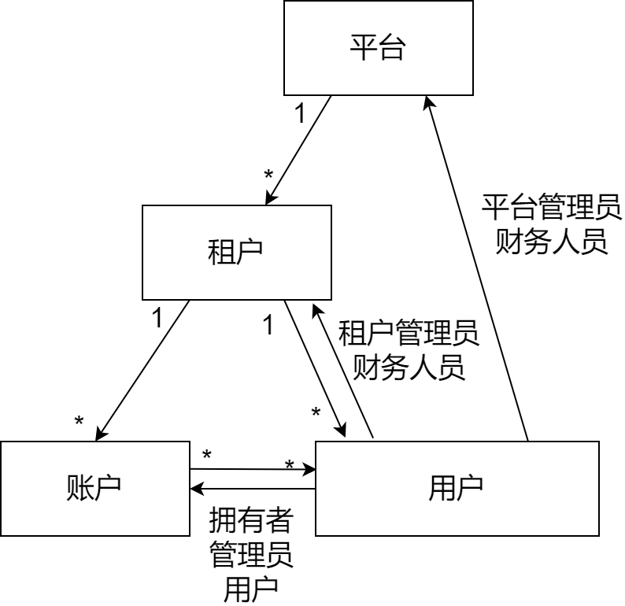

# 用户模型

系统使用三级的用户模型：**租户(tenant)**、**账户(account)**、**用户(user)**。各级之间的关系如下图所示：



每个用户和账户属于且只属于一个租户，一个用户可以属于0个或者多个账户，每个用户在账户中的角色为**用户**、**管理员**或者**拥有者**之一，可另为租户和整个平台的**租户管理员**和**财务人员**（可均为）。

每个用户的用户名和账户名在**整个平台的范围**（注意，并非租户）中唯一。在所使用的认证系统支持的情况下，账户管理员、租户管理员可以创建用户。

## 导入已有用户信息

如果您已有一个slurm集群，可以使用本功能将slurm中的用户信息导入本系统。

把[slurm-users.py](%REPO_URL%/apps/mis-server/scripts/slurm-users.py)复制到[slurm.sh](../deployment/clusterops.md#部署slurmsh)的目录下，运行以下命令，获得一个`users.json`文件。

```bash
MYSQL_PASSWORD={数据库密码} python3 slurm-users.py
```

`users.json`的文件初始数据格式如下。不存在名字的用户的初始名字为自己的ID。

请在导入前确认每个账户都有一个用户的包含`owner`字段。如果没有，请手动将账户的拥有者的用户后面增加`,owner`。在执行`slurm-users.py`的过程中，如果遇到某个账户不存在拥有者，系统将会给出警告。

`slurm-users.py`默认将`用户ID == a_账户ID`的用户设置为拥有者。如果这不满足您的需求，请在`slurm-users.py`中修改。

```json5
{
    "accounts": {
        "a_abc": { // 账户
          "abc": "allowed!,owner", // 用户ID：allowed!表示用户未被封锁，owner表示此用户为账户的拥有者 
          "yhh": "blocked!" // 用户ID：blocked!表示用户被封锁
        }
    },
    "names": {
      "abc": "abc的名字"
    }
}
```

获取`users.json`之后，在系统初始化时，或者系统初始化后使用平台管理员用户登录后选择**平台管理**->**导入用户**，将`users.json`的内容复制进去。如果需要将新加入的账户都加入白名单中，请勾选`将所有账户加入白名单`。点击确定，即可将所有账户导入默认租户中。


